# console_app_csharp
1. Simple Creator
2. Complex Creator
3. Triangle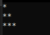
4. Fahrenheit/Celsius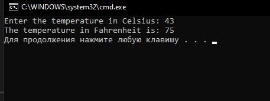
5. Average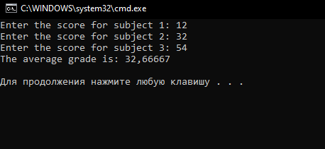
6. Datatype to Datatype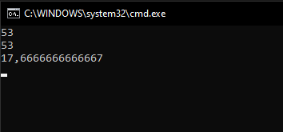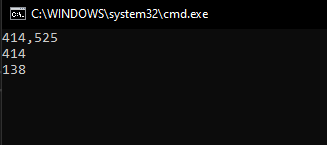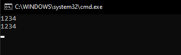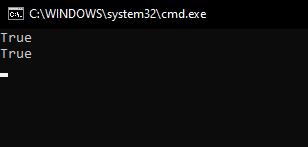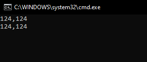
7. Increment/Decrement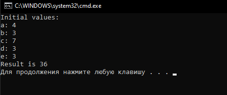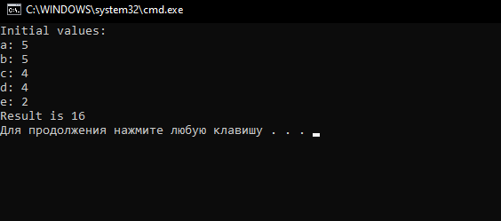
8. if/else/switch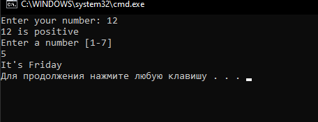
9. Recursion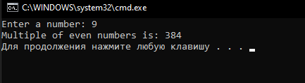
10. Reversed_String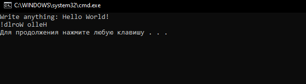
11. Looped_Factorial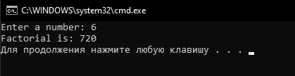
12. Ternary_Operator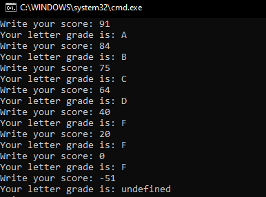
13. Swap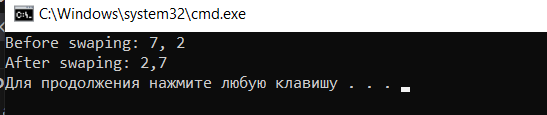
14. Student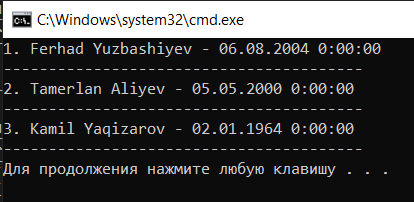